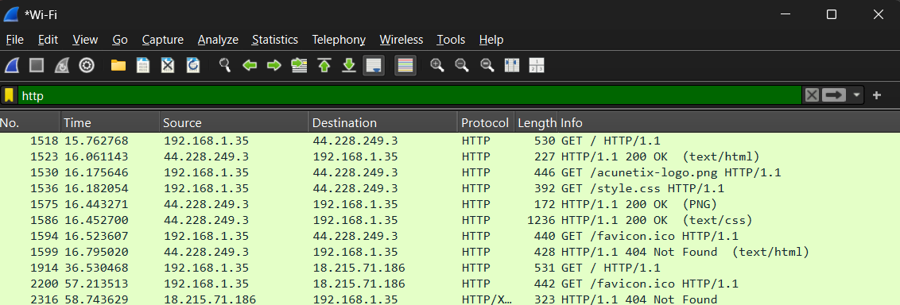

# 📡 Monitoring Network Traffic with Wireshark

Wireshark is a **network protocol analyzer** that captures and inspects network packets in real time.  
I used it in this task to identify normal traffic such as **DNS** and **HTTP**, and also to detect suspicious patterns like **port scans**.

---

## 🔑 Key Features
- **Live capture & offline analysis** – record packets for later review.  
- **Filtering** – e.g., show only DNS or HTTP traffic.  
- **Protocol decoding** – see what a DNS query or HTTP request looks like.  
- **Visualization tools** – graphs, flow analysis, conversations.  
- **Cross-platform support** – runs on Windows, Linux, and macOS.  

---

## 📂 Requests Captured Using Wireshark

### a) HTTP  
- **Description**: HTTP (Hypertext Transfer Protocol) is the foundation of web communication, enabling clients and servers to exchange data such as web pages and files.  
- **Analysis**: I identified HTTP traffic by filtering on **port 80**, which showed unencrypted web requests.
  **Wireshark Capture:**  

### b) DNS  
- **Description**: DNS (Domain Name System) resolves domain names into IP addresses so that devices can locate and communicate with each other.  
- **Analysis**: I identified DNS traffic by filtering on **port 53** and observed queries for websites I visited (e.g., `google.com`).
  **Wireshark Capture:**  

### c) TLS  
- **Description**: TLS (Transport Layer Security) is a protocol that encrypts and secures communication between devices.  
- **Analysis**: I identified TLS traffic when accessing **HTTPS websites**. The content was encrypted, but the **Server Name Indication (SNI)** was still visible.
  **Wireshark Capture:**  
 

---

## 🛡️ Additional Security Measures for Larger Networks

1. **Network Segmentation (VLANs):**  
   Divide the network into smaller zones (e.g., HR, Finance, Guest Wi-Fi) to limit lateral movement by attackers.  

2. **Intrusion Detection/Prevention Systems (IDS/IPS):**  
   Deploy tools like **Snort** or **Suricata** to detect and block suspicious traffic patterns.  

3. **Centralized Logging & Monitoring (SIEM):**  
   Use platforms such as **Splunk** or **ELK** to collect and analyze logs for real-time threat detection.  

4. **Regular Patching & Updates:**  
   Keep operating systems, applications, and network devices up to date to eliminate known vulnerabilities.  

5. **Access Control & Multi-Factor Authentication (MFA):**  
   Restrict user permissions to **least privilege** and enforce **MFA** to strengthen identity security.  

---

### ✅ Summary
Wireshark provides deep insights into network activity by analyzing HTTP, DNS, and TLS traffic.  
Combined with **segmentation, IDS/IPS, SIEM, patching, and MFA**, it strengthens overall **network security posture**.
